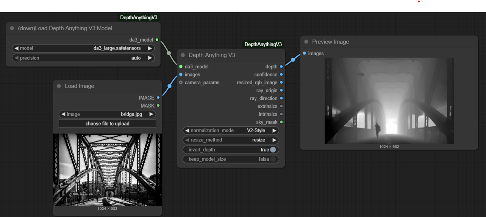
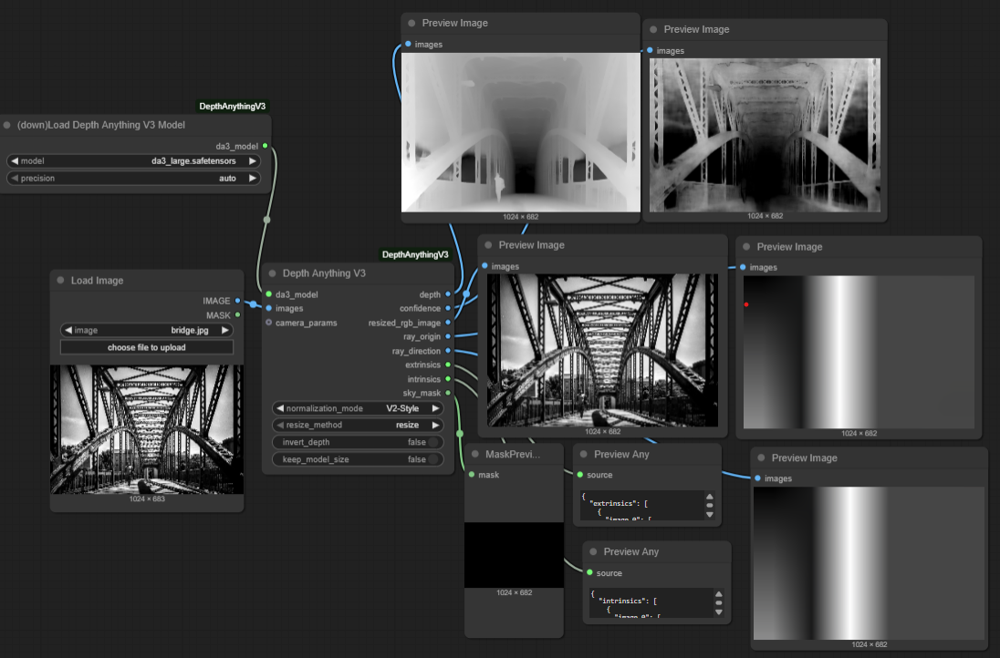
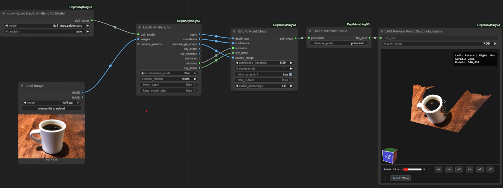
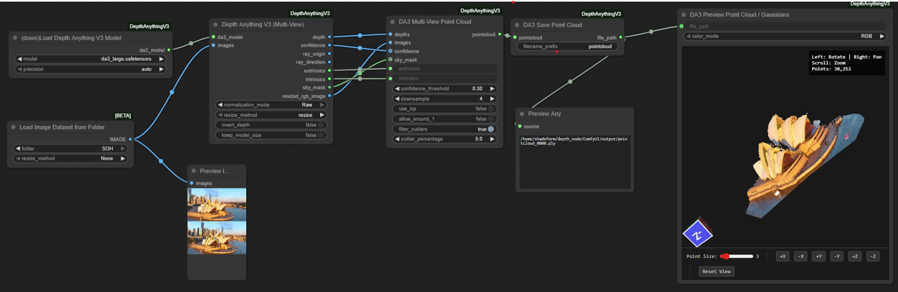
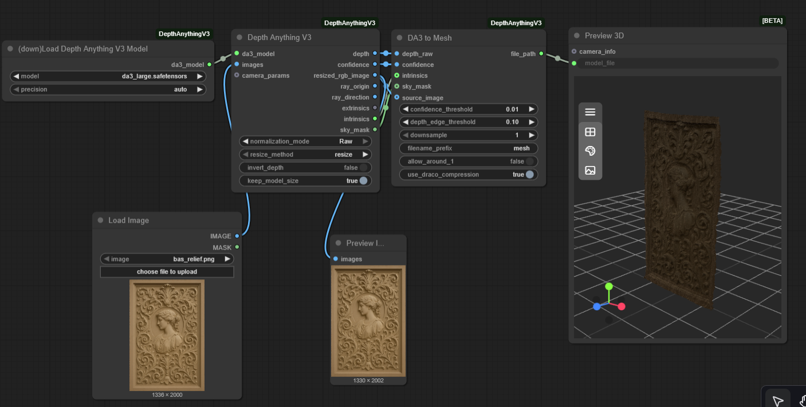
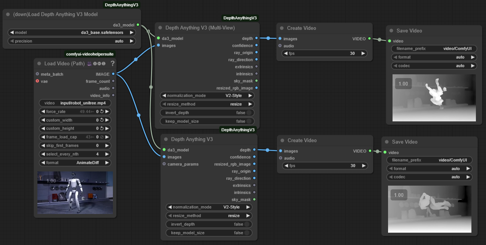

# ComfyUI Depth Anything V3

## Installation

Three options, in order of speed → reliability:

1. **ComfyUI Manager (nightly)** — search for `ComfyUI-DepthAnythingV3` in the Manager and click Install. Fastest, but the Manager's nightly index can lag.
2. **Manager via Git URL** — in ComfyUI Manager: "Install via Git URL" with `https://github.com/PozzettiAndrea/ComfyUI-DepthAnythingV3.git`.
3. **Manual (most reliable)**:
   ```bash
   cd ComfyUI/custom_nodes
   git clone https://github.com/PozzettiAndrea/ComfyUI-DepthAnythingV3.git
   cd ComfyUI-DepthAnythingV3
   pip install -r requirements.txt --upgrade
   python install.py
   ```


<div align="center">
<a href="https://pozzettiandrea.github.io/ComfyUI-DepthAnythingV3/">

</a>
<br>
<b><a href="https://pozzettiandrea.github.io/ComfyUI-DepthAnythingV3/">View Live Test Gallery →</a></b>
</div>

Custom nodes for [Depth Anything V3](https://github.com/ByteDance-Seed/Depth-Anything-3) integration with ComfyUI.

Simple workflow:


Advanced workflow:


Single image to 3d:


Multiple image to 3d:


Single image to mesh:


Use multi attention node for smooth video depth!


## Demo Videos

You can use the multi-view node to use the cross attention feature of the main class of models. This is done to have a more consistent depth across frames of a video.


https://github.com/user-attachments/assets/058bd968-aae3-4759-887c-4c98132559f0


You can reconstruct 3D point clouds!


https://github.com/user-attachments/assets/8ef6e74b-c7c7-41e7-b1c6-de44733e6c61


Even from multiple views, with the option to either match them (with icp) or leave them to use the predicted camera positions. You also have a field on the point cloud to show you which view each point came from.


https://github.com/user-attachments/assets/6892313d-bcd8-44ec-9038-7d4d8915f59e


## Description

Depth Anything V3 is the latest depth estimation model that predicts spatially consistent geometry from visual inputs.

**Published**: November 14, 2025
**Paper**: [Depth Anything 3: Recovering the Visual Space from Any Views](https://arxiv.org/abs/2511.10647)

## Model Variants

| Model | Size | Features |
|-------|------|----------|
| DA3-Small | 80M | Fast, good quality |
| DA3-Base | 220M | Balanced quality and speed |
| DA3-Large | 350M | High quality, balanced |
| DA3-Giant | 1.15B | Best quality, slower |
| DA3Mono-Large | 350M | Optimized for monocular depth |
| DA3Metric-Large | 350M | Metric depth estimation |
| DA3Nested-Giant-Large | 1.4B | Combined model with metric scaling |

## Model Capabilities

Different models support different features:

| Feature | Small/Base/Large/Giant | Mono-Large | Metric-Large | Nested |
|---------|------------------------|------------|--------------|--------|
| **Sky Segmentation** | ❌ | ✅ | ✅ | ✅ |
| **Camera Conditioning** | ✅ | ❌ | ❌ | ✅ |
| **Multi-View Attention** | ✅ | ⚠️ | ⚠️ | ✅ |
| **3D Gaussians** | ✅* | ❌ | ❌ | ✅* |
| **Ray Maps** | ✅ | ❌ | ❌ | ✅ |

- ✅ = Fully supported
- ❌ = Not available (returns zeros/ignored)
- ⚠️ = Works but no cross-view attention benefit (images processed independently)
- ✅* = Requires fine-tuned model weights (placeholder in current release)

**Choose your model based on needs:**
- Need sky masks? → Use Mono/Metric/Nested (required for V2-Style normalization)
- Need camera conditioning? → Use Main series or Nested
- Processing video/multi-view? → Use Main series or Nested for consistency
- Single images only? → Any model works

## Workflow Tips

### For ControlNet Depth Workflows
1. Use **Mono** or **Metric** models (they provide sky segmentation)
2. Set **normalization_mode** to **V2-Style** (default)
3. Connect the `depth` output to your ControlNet node
4. Enjoy clean depth maps with proper sky handling!

### For 3D Reconstruction (Point Clouds)
1. Use any model (Mono/Metric recommended for sky filtering)
2. Set **normalization_mode** to **Raw**
3. Connect `depth` → `depth_raw`, `confidence` → `confidence`, `sky_mask` → `sky_mask` to **DA3 to Point Cloud**
4. Sky pixels will be automatically excluded if sky_mask is connected
5. **Important**: Point cloud nodes validate input and will raise an error if normalized depth is detected (prevents incorrect 3D output)

## Community

Questions or feature requests? Open a [Discussion](https://github.com/PozzettiAndrea/ComfyUI-DepthAnythingV3/discussions) on GitHub.

Join the [Comfy3D Discord](https://discord.gg/bcdQCUjnHE) for help, updates, and chat about 3D workflows in ComfyUI.

## Credits

- **Original Paper**: Haotong Lin, Sili Chen, Jun Hao Liew, et al. (ByteDance Seed Team)
- **Original Implementation**: [PozzettiAndrea](https://github.com/PozzettiAndrea)
- **V2-Style Normalization**: [Ltamann (TBG)](https://github.com/Ltamann) - See [TBG Takeaways: Depth Anything V3](https://www.patreon.com/posts/tbg-takeaways-v3-143804015) for workflow examples
- **Based on**: Official [Depth Anything 3 repository](https://github.com/ByteDance-Seed/Depth-Anything-3)
- **Inspiration**: [kijai's ComfyUI-Depth-Anything-V2](https://github.com/kijai/ComfyUI-DepthAnythingV2)

## License

Model architecture files based on Depth Anything 3 (Apache 2.0 / CC BY-NC 4.0 depending on model).

Note: Some models (Giant, Nested) use CC BY-NC 4.0 license (non-commercial use only).
